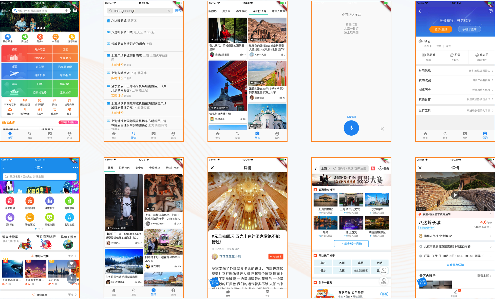

# flutter_trip

A new Flutter project.

## Getting Started

### flutter get package

### flutter run 

## page

### 首页
1. 渐变导航栏
2. 基于GirdView实现复杂UI
3. 基于http,实现网络请求
4. 基于shared_preferences,实现本地缓存
5. Flutter异步编程

### 搜索
1. 高度封装定制导航栏搜索框
2. 实现动态icon,与富文本
3. 待续

## UI

